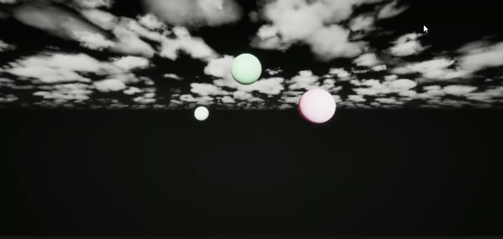

# Planet Rotation Demo

A small demo scene created with **Unreal Engine (Blueprints)**.  
It simulates three planets orbiting around a central light.  

## Features
- Blueprint-based planet rotation
- Material setup for simple visuals
- Real-time orbit simulation
- Color change when orbit completes its turn

## Tech
- Unreal Engine (Blueprints)

This is my first Unreal Engine project using Blueprint scriptings.

